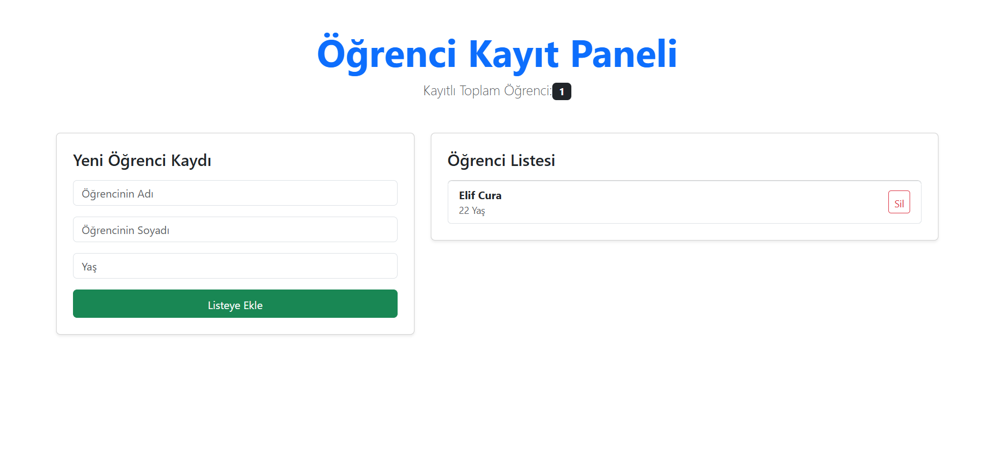

## Öğrenci Kayıt Paneli (React)

Bu proje, React'ta **"Lifting State Up" (Durumu Yukarı Taşıma)** mantığını ve form yönetimini pekiştirmek amacıyla geliştirilmiş bir uygulamadır. Kullanıcılar öğrenci kaydı ekleyebilir ve kayıtlı öğrencileri listeden silebilirler.

##  Özellikler

* **Dinamik Öğrenci Ekleme:** Form üzerinden Ad, Soyad ve Yaş bilgileriyle yeni kayıt oluşturma.
* **Öğrenci Silme:** Liste üzerindeki "Sil" butonu ile kayıtları anında kaldırma.
* **Canlı Sayaç:** Toplam kayıtlı öğrenci sayısını anlık olarak takip etme.
* **Responsive Tasarım:** Bootstrap kullanılarak tüm cihazlarla uyumlu (mobil dostu) arayüz.
* **State Yönetimi:** Verilerin tek bir merkezden (`App.jsx`) yönetilmesi.

##  Kullanılan Teknolojiler

* **React 18**
* **Vite** (Hızlı geliştirme ortamı)
* **Bootstrap 5** (Arayüz tasarımı)
* **JavaScript (ES6+)**

## 
